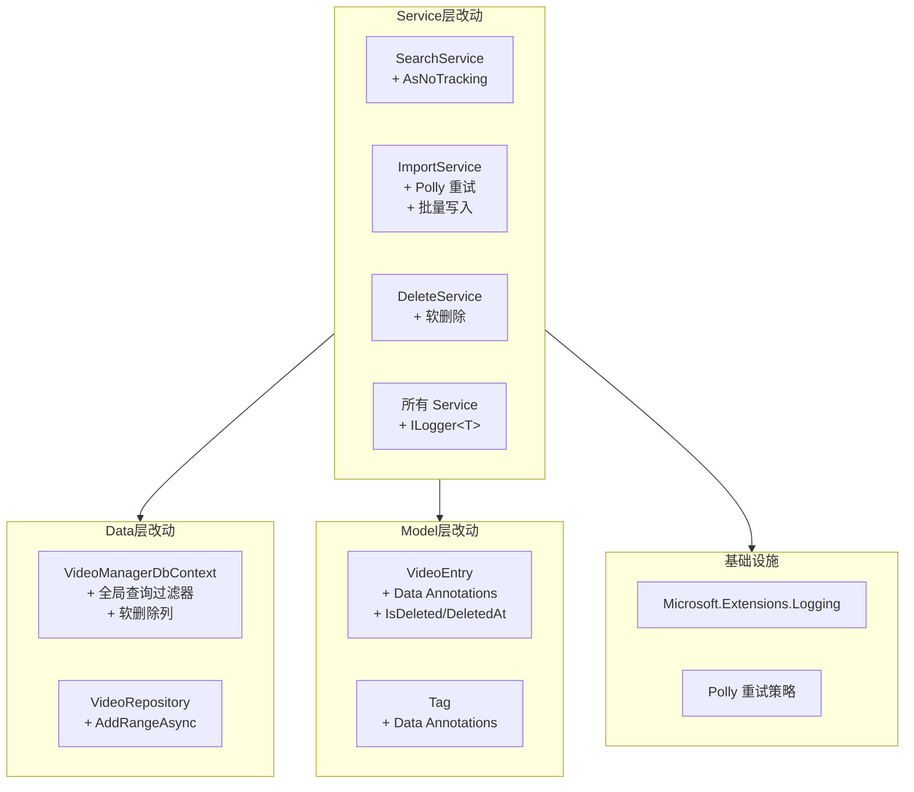
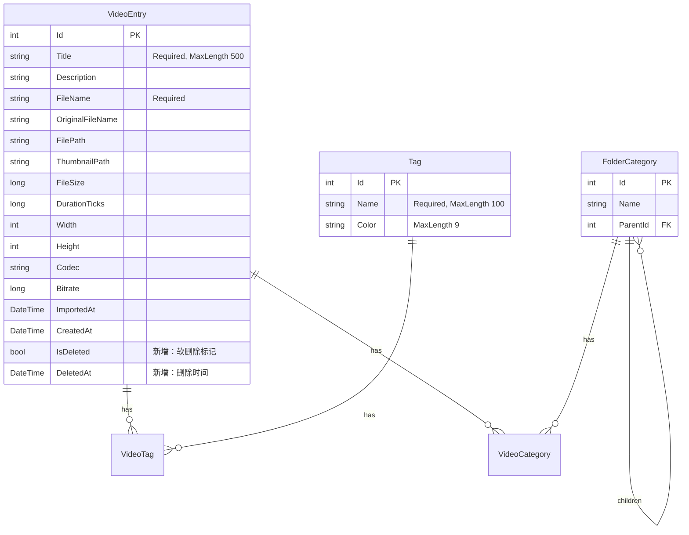

# 设计文档：视频管理器优化 V2

## 概述

本设计文档描述 VideoManager 应用第二轮优化方案。在第一轮优化完成 MVVM 架构重构、基础功能完善后，本轮聚焦于性能优化（查询 AsNoTracking）、工程质量提升（结构化日志、输入验证统一）、可靠性增强（Polly 重试）、数据库效率（批量操作）、以及数据安全（软删除机制）。

所有改动基于现有架构进行增量修改，不改变核心 MVVM 分层和 DI 模式。

## 架构

本轮优化不引入新的架构层，而是在现有层内进行增强：



### 关键架构决策

1. **AsNoTracking 仅用于只读路径**：SearchService 和 VideoRepository.GetPagedAsync（已有）的查询添加 AsNoTracking，EditService/DeleteService 的查询不添加（需要 Change Tracker 追踪修改）
2. **Polly 重试策略通过委托注入**：不直接在 ImportService 中硬编码 Polly，而是通过可注入的重试策略委托实现，便于测试时替换
3. **软删除使用全局查询过滤器**：通过 EF Core 的 `HasQueryFilter` 自动排除已删除记录，需要查询已删除记录时使用 `IgnoreQueryFilters()`
4. **批量写入带回退机制**：AddRangeAsync 失败时自动回退到逐条 AddAsync，确保最大化成功率
5. **日志框架选择 Microsoft.Extensions.Logging**：与现有 DI 体系无缝集成，通过 `AddLogging()` 一行代码完成注册

## 组件与接口

### 需求 1：SearchService AsNoTracking 改动

```csharp
// SearchService.SearchAsync 中的查询改动
// 改动前：
IQueryable<VideoEntry> query = _context.VideoEntries
    .Include(v => v.Tags)
    .Include(v => v.Categories);

// 改动后：
IQueryable<VideoEntry> query = _context.VideoEntries
    .Include(v => v.Tags)
    .Include(v => v.Categories)
    .AsNoTracking();
```

影响范围：仅 `SearchService.SearchAsync` 方法。`VideoRepository.GetPagedAsync` 已有 AsNoTracking，无需改动。

### 需求 2：结构化日志

```csharp
// App.xaml.cs DI 注册
services.AddLogging(builder =>
{
    builder.AddDebug();
    builder.SetMinimumLevel(LogLevel.Debug);
});

// Service 构造函数注入示例（以 ImportService 为例）
public class ImportService : IImportService
{
    private readonly ILogger<ImportService> _logger;

    public ImportService(
        IFFmpegService ffmpegService,
        IVideoRepository videoRepository,
        IOptions<VideoManagerOptions> options,
        ILogger<ImportService> logger)  // 新增
    {
        _logger = logger;
    }
}
```

需要注入 `ILogger<T>` 的 Service 类：
- `ImportService` — 导入进度、FFmpeg 调用失败、重试日志
- `DeleteService` — 删除操作、文件删除失败
- `SearchService` — 搜索执行（Debug 级别）
- `EditService` — 编辑操作
- `FileWatcherService` — 替代现有 `Trace.TraceError`
- `ThumbnailCacheService` — 缓存命中/未命中（Debug 级别）
- `WindowSettingsService` — 配置读写失败

### 需求 3：输入验证

```csharp
// VideoEntry 模型添加 Data Annotations
using System.ComponentModel.DataAnnotations;

public class VideoEntry : INotifyPropertyChanged
{
    public int Id { get; set; }

    [Required]
    [StringLength(500)]
    public string Title { get; set; } = string.Empty;

    public string? Description { get; set; }

    [Required]
    public string FileName { get; set; } = string.Empty;

    // 其他属性不变...
}

// Tag 模型添加 Data Annotations
public class Tag
{
    public int Id { get; set; }

    [Required]
    [StringLength(100)]
    public string Name { get; set; } = string.Empty;

    [StringLength(9)]
    public string? Color { get; set; }

    public ICollection<VideoEntry> Videos { get; set; } = new List<VideoEntry>();
}
```

```csharp
// 验证辅助方法（新增静态工具类）
using System.ComponentModel.DataAnnotations;

namespace VideoManager.Services;

public static class ValidationHelper
{
    /// <summary>
    /// 验证实体的 Data Annotations，失败时抛出 ValidationException。
    /// </summary>
    public static void ValidateEntity(object entity)
    {
        var context = new ValidationContext(entity);
        var results = new List<ValidationResult>();
        if (!Validator.TryValidateObject(entity, context, results, validateAllProperties: true))
        {
            var errors = string.Join("; ", results.Select(r => r.ErrorMessage));
            throw new ValidationException($"Validation failed: {errors}");
        }
    }
}
```

### 需求 4：Polly 重试策略

```csharp
// ImportService 中的重试逻辑
// 使用 Polly 的 RetryPolicy 包装 FFmpeg 调用

private static readonly ResiliencePipeline RetryPipeline =
    new ResiliencePipelineBuilder()
        .AddRetry(new RetryStrategyOptions
        {
            MaxRetryAttempts = 2,
            Delay = TimeSpan.FromSeconds(1),
            BackoffType = DelayBackoffType.Linear,
            ShouldHandle = new PredicateBuilder()
                .Handle<Exception>(ex => ex is not OperationCanceledException)
        })
        .Build();

// 使用示例
private async Task<VideoMetadata> ExtractMetadataWithRetryAsync(string path, CancellationToken ct)
{
    try
    {
        return await RetryPipeline.ExecuteAsync(
            async token => await _ffmpegService.ExtractMetadataAsync(path, token),
            ct);
    }
    catch (Exception ex) when (ex is not OperationCanceledException)
    {
        _logger.LogWarning(ex, "元数据提取重试全部失败，使用默认值: {Path}", path);
        return new VideoMetadata(TimeSpan.Zero, 0, 0, string.Empty, 0);
    }
}
```

NuGet 依赖：`Microsoft.Extensions.Resilience`（包含 Polly v8）或直接使用 `Polly.Core`。

### 需求 5：Repository 批量操作

```csharp
// IVideoRepository 新增方法
public interface IVideoRepository
{
    // 现有方法不变...
    Task<VideoEntry> AddAsync(VideoEntry entry, CancellationToken ct);
    Task<VideoEntry?> GetByIdAsync(int id, CancellationToken ct);
    Task UpdateAsync(VideoEntry entry, CancellationToken ct);
    Task DeleteAsync(int id, CancellationToken ct);
    Task<PagedResult<VideoEntry>> GetPagedAsync(int page, int pageSize, CancellationToken ct,
        SortField sortBy = SortField.ImportedAt, SortDirection sortDir = SortDirection.Descending);

    // 新增批量添加
    Task AddRangeAsync(IEnumerable<VideoEntry> entries, CancellationToken ct);
}

// VideoRepository 实现
public async Task AddRangeAsync(IEnumerable<VideoEntry> entries, CancellationToken ct)
{
    _context.VideoEntries.AddRange(entries);
    await _context.SaveChangesAsync(ct);
}
```

```csharp
// ImportService 改动：收集所有成功的 entry，最后批量写入
// Phase 2 结束后：
var successEntries = new List<VideoEntry>(); // 并行阶段收集
try
{
    await _videoRepository.AddRangeAsync(successEntries, ct);
}
catch (Exception ex)
{
    _logger.LogWarning(ex, "批量写入失败，回退到逐条写入");
    foreach (var entry in successEntries)
    {
        try { await _videoRepository.AddAsync(entry, ct); }
        catch (Exception innerEx)
        {
            _logger.LogError(innerEx, "逐条写入失败: {Title}", entry.Title);
            errors.Add(new ImportError(entry.FilePath, innerEx.Message));
        }
    }
}
```

### 需求 6：软删除机制

```csharp
// VideoEntry 新增属性
public class VideoEntry : INotifyPropertyChanged
{
    // 现有属性...

    /// <summary>
    /// 软删除标记。true 表示已删除。
    /// </summary>
    public bool IsDeleted { get; set; }

    /// <summary>
    /// 软删除时间（UTC）。
    /// </summary>
    public DateTime? DeletedAt { get; set; }
}
```

```csharp
// DbContext 全局查询过滤器
protected override void OnModelCreating(ModelBuilder modelBuilder)
{
    // 现有配置...

    // 软删除全局过滤器
    modelBuilder.Entity<VideoEntry>()
        .HasQueryFilter(v => !v.IsDeleted);
}
```

```csharp
// DeleteService 改为软删除
public async Task<DeleteResult> DeleteVideoAsync(int videoId, bool deleteFile, CancellationToken ct)
{
    var video = await _context.VideoEntries
        .Include(v => v.Tags)
        .Include(v => v.Categories)
        .FirstOrDefaultAsync(v => v.Id == videoId, ct);

    if (video is null)
        return new DeleteResult(false, $"Video with ID {videoId} was not found.");

    string? fileError = null;
    if (deleteFile)
        fileError = TryDeleteFiles(video.FilePath, video.ThumbnailPath);

    // 软删除：设置标记而非物理删除
    video.Tags.Clear();
    video.Categories.Clear();
    video.IsDeleted = true;
    video.DeletedAt = DateTime.UtcNow;
    await _context.SaveChangesAsync(ct);

    return new DeleteResult(true, fileError);
}
```

## 数据模型

### VideoEntry 扩展

```csharp
public class VideoEntry : INotifyPropertyChanged
{
    // 现有属性保持不变...

    // 新增 Data Annotations
    [Required]
    [StringLength(500)]
    public string Title { get; set; } = string.Empty;

    [Required]
    public string FileName { get; set; } = string.Empty;

    // 新增软删除字段
    public bool IsDeleted { get; set; }
    public DateTime? DeletedAt { get; set; }
}
```

### Tag 扩展

```csharp
public class Tag
{
    public int Id { get; set; }

    [Required]
    [StringLength(100)]
    public string Name { get; set; } = string.Empty;

    [StringLength(9)]
    public string? Color { get; set; }

    public ICollection<VideoEntry> Videos { get; set; } = new List<VideoEntry>();
}
```

### 数据库迁移

新增 EF Core 迁移添加软删除列：

```sql
ALTER TABLE VideoEntries ADD COLUMN IsDeleted INTEGER NOT NULL DEFAULT 0;
ALTER TABLE VideoEntries ADD COLUMN DeletedAt TEXT NULL;
```

### ER 图更新



## 正确性属性

### Property 1: AsNoTracking 查询结果一致性

*For any* 搜索条件和数据库中的视频集合，使用 AsNoTracking 的搜索查询返回的结果集（ID、Title、Tags 数量）应与不使用 AsNoTracking 的查询结果完全一致。

**Validates: Requirements 1.1, 1.3**

### Property 2: Data Annotations 验证正确性

*For any* 字符串 s，当 s 的长度超过 VideoEntry.Title 的 StringLength 限制（500）时，验证应失败；当 s 非空且长度在限制内时，验证应通过。对于 Tag.Name（限制 100）和 Tag.Color（限制 9）同理。

**Validates: Requirements 3.1, 3.2**

### Property 3: 重试策略行为

*For any* 失败次数 n（0 ≤ n ≤ 10），当 FFmpeg 调用在第 n 次失败后成功时：若 n ≤ 2，最终应返回正常元数据；若 n > 2，最终应返回默认元数据（时长为零）。总调用次数应为 min(n+1, 3)。

**Validates: Requirements 4.2, 4.3, 4.4**

### Property 4: 批量写入一致性

*For any* VideoEntry 列表（1-100 条），通过 AddRangeAsync 批量写入后，数据库中应存在所有写入的记录，且记录数等于列表长度。

**Validates: Requirements 5.2, 5.3**

### Property 5: 软删除全局过滤器

*For any* 数据库中包含 N 条未删除记录和 M 条已软删除记录的状态，常规查询（不使用 IgnoreQueryFilters）返回的记录数应恰好为 N，不包含任何 IsDeleted=true 的记录。

**Validates: Requirements 6.2**

### Property 6: 软删除状态设置

*For any* 数据库中存在的 VideoEntry，执行软删除后，该记录的 IsDeleted 应为 true，DeletedAt 应不为 null 且为 UTC 时间，且该记录通过常规查询不可见。

**Validates: Requirements 6.3**

## 错误处理

### 查询优化错误

| 场景 | 处理方式 |
|------|----------|
| AsNoTracking 查询异常 | 记录 Error 日志，向上抛出异常 |

### 日志错误

| 场景 | 处理方式 |
|------|----------|
| 日志写入失败 | 框架内部处理，不影响业务逻辑 |

### 验证错误

| 场景 | 处理方式 |
|------|----------|
| Title 为空或超长 | 抛出 ValidationException，包含具体字段和错误信息 |
| Tag.Name 为空或超长 | 抛出 ValidationException |
| Tag.Color 格式不合法 | 抛出 ValidationException |

### 重试错误

| 场景 | 处理方式 |
|------|----------|
| FFmpeg 调用瞬态失败 | 自动重试最多 2 次，间隔 1s/2s |
| 重试全部失败 | 使用默认元数据，记录 Warning 日志 |
| OperationCanceledException | 不重试，直接抛出 |

### 批量操作错误

| 场景 | 处理方式 |
|------|----------|
| AddRangeAsync 失败 | 回退到逐条 AddAsync，记录 Warning 日志 |
| 逐条写入也失败 | 记录 Error 日志，添加到错误列表 |

### 软删除错误

| 场景 | 处理方式 |
|------|----------|
| 软删除时视频不存在 | 返回 DeleteResult(false, "not found") |
| 文件删除失败 | 完成软删除标记，返回文件错误信息 |

## 测试策略

### 测试框架

- **单元测试框架**：xUnit
- **属性测试框架**：FsCheck（FsCheck.Xunit 3.3.2）
- **Mocking 框架**：Moq
- **数据库测试**：SQLite In-Memory provider
- **新增依赖**：Polly.Core（用于重试策略测试）

### 测试分层

```
├── VideoManager.Tests/
│   ├── Unit/
│   │   ├── Services/
│   │   │   ├── SearchServiceAsNoTrackingTests.cs    (需求 1)
│   │   │   ├── LoggingIntegrationTests.cs           (需求 2)
│   │   │   ├── ValidationHelperTests.cs             (需求 3)
│   │   │   ├── ImportServiceRetryTests.cs           (需求 4)
│   │   │   ├── VideoRepositoryBatchTests.cs         (需求 5)
│   │   │   └── SoftDeleteServiceTests.cs            (需求 6)
│   └── Property/
│       ├── AsNoTrackingPropertyTests.cs             (Property 1)
│       ├── ValidationPropertyTests.cs               (Property 2)
│       ├── RetryPolicyPropertyTests.cs              (Property 3)
│       ├── BatchWritePropertyTests.cs               (Property 4)
│       ├── SoftDeleteFilterPropertyTests.cs         (Property 5)
│       └── SoftDeleteStatePropertyTests.cs          (Property 6)
```

### 属性测试配置示例

```csharp
// Feature: video-manager-optimization-v2, Property 3: 重试策略行为
[Property(MaxTest = 100)]
public Property RetryPolicyShouldRespectMaxAttempts()
{
    return Prop.ForAll(
        Gen.Choose(0, 10).ToArbitrary(),  // 失败次数
        failCount =>
        {
            var callCount = 0;
            var mockFfmpeg = new Mock<IFFmpegService>();
            mockFfmpeg.Setup(f => f.ExtractMetadataAsync(It.IsAny<string>(), It.IsAny<CancellationToken>()))
                .Returns(() =>
                {
                    callCount++;
                    if (callCount <= failCount)
                        throw new IOException("Transient failure");
                    return Task.FromResult(new VideoMetadata(TimeSpan.FromMinutes(5), 1920, 1080, "h264", 5000000));
                });

            // Execute with retry...
            var expectedCalls = Math.Min(failCount + 1, 3);
            return callCount == expectedCalls;
        });
}
```

```csharp
// Feature: video-manager-optimization-v2, Property 5: 软删除全局过滤器
[Property(MaxTest = 100)]
public Property SoftDeleteFilterShouldExcludeDeletedRecords()
{
    return Prop.ForAll(
        Gen.Choose(0, 20).ToArbitrary(),  // 未删除数
        Gen.Choose(0, 20).ToArbitrary(),  // 已删除数
        (activeCount, deletedCount) =>
        {
            using var context = CreateInMemoryContext();
            // 插入 activeCount 条未删除 + deletedCount 条已删除
            // 查询应只返回 activeCount 条
            var result = context.VideoEntries.Count();
            return result == activeCount;
        });
}
```
