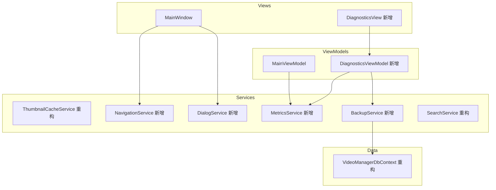

# 设计文档

## 概述

本设计文档描述 VideoManager 第三轮优化的技术方案。基于已有的 MVVM 架构（CommunityToolkit.Mvvm）、EF Core + SQLite 数据层、以及 DI 容器，在六个领域进行增量改进：LRU 缓存与 WeakReference 内存管理、EF Core 编译查询与 WAL 模式、取消令牌与进度预估、SQLite 自动备份与恢复、导航/对话框服务解耦、以及性能指标收集与诊断视图。

## 架构

现有架构保持不变（Views → ViewModels → Services → Repositories → DbContext）。本轮优化新增以下组件：



## 组件与接口

### 1. LruCache\<TKey, TValue\>

通用线程安全 LRU 缓存，基于 `LinkedList` + `ConcurrentDictionary` 实现。

```csharp
public class LruCache<TKey, TValue> where TKey : notnull
{
    public LruCache(int capacity);
    public int Count { get; }
    public int Capacity { get; }
    public bool TryGet(TKey key, out TValue? value);  // 命中时移到链表头部
    public void Put(TKey key, TValue value);           // 超容量时淘汰尾部
    public void Remove(TKey key);
    public void Clear();
}
```

内部使用 `lock` 保证线程安全（缩略图缓存并发度不高，lock 足够）。

### 2. 重构 ThumbnailCacheService

将内部 `ConcurrentDictionary<string, string?>` 替换为 `LruCache<string, WeakReference<BitmapImage>>`。

```csharp
public interface IThumbnailCacheService
{
    Task<string?> LoadThumbnailAsync(string thumbnailPath);
    void ClearCache();
    int CacheCount { get; }        // 新增：当前缓存条目数
    int CacheHitCount { get; }     // 新增：命中计数
    int CacheMissCount { get; }    // 新增：未命中计数
}
```

实现策略：
- 缓存 key 为缩略图路径，value 为 `WeakReference<string>`（路径字符串的弱引用）
- 当 WeakReference.TryGetTarget 失败时，视为缓存未命中，重新加载
- LRU 容量从 `VideoManagerOptions.ThumbnailCacheMaxSize` 读取

### 3. MetricsService

```csharp
public interface IMetricsService : IDisposable
{
    // 内存指标
    long ManagedMemoryBytes { get; }
    int ThumbnailCacheCount { get; }
    double ThumbnailCacheHitRate { get; }

    // 操作计时
    IDisposable StartTimer(string operationName);  // 返回 Disposable，Dispose 时记录耗时
    TimeSpan GetAverageTime(string operationName);
    TimeSpan GetLastTime(string operationName);

    // 内存监控
    long MemoryWarningThresholdBytes { get; set; }
    void CheckMemoryUsage();  // 超阈值时记录警告日志
}
```

实现：
- 使用 `System.Diagnostics.Stopwatch` 计时
- 使用 `GC.GetTotalMemory(false)` 采集托管堆内存
- 使用 `System.Threading.Timer` 每 5 秒采集一次内存指标
- 操作耗时存储在 `ConcurrentDictionary<string, List<TimeSpan>>` 中，保留最近 100 条

### 4. BackupService

```csharp
public interface IBackupService
{
    Task<bool> CheckIntegrityAsync(CancellationToken ct);
    Task<string> CreateBackupAsync(CancellationToken ct);
    Task RestoreFromBackupAsync(string backupFilePath, CancellationToken ct);
    List<BackupInfo> ListBackups();
    Task CleanupOldBackupsAsync(CancellationToken ct);
}

public record BackupInfo(string FilePath, DateTime CreatedAt, long FileSizeBytes);
```

实现：
- 备份通过 SQLite 的 `VACUUM INTO` 命令实现（原子性、不阻塞读取）
- 完整性检查通过 `PRAGMA integrity_check` 实现
- 恢复流程：先备份当前 DB → 关闭连接 → 复制备份文件覆盖 → 重新打开连接
- 备份文件命名：`videomanager_backup_{yyyyMMdd_HHmmss}.db`
- 定期备份使用 `System.Threading.Timer`，间隔从配置读取

### 5. NavigationService

```csharp
public interface INavigationService
{
    Task OpenVideoPlayerAsync(VideoEntry video);
    Task<ImportResult?> OpenImportDialogAsync();
}
```

实现：
- 注入到 MainViewModel，替代 MainWindow 代码隐藏中的窗口创建逻辑
- 内部通过 `Application.Current.Dispatcher` 确保在 UI 线程创建窗口
- 通过 DI 容器获取 ViewModel 实例

### 6. DialogService

```csharp
public interface IDialogService
{
    Task<bool> ShowEditDialogAsync(VideoEntry video);
    Task<(bool Confirmed, bool DeleteFile)?> ShowDeleteConfirmAsync(string title);
    Task<(bool Confirmed, bool DeleteFile)?> ShowBatchDeleteConfirmAsync(int count);
    Task<List<Tag>?> ShowBatchTagDialogAsync(IEnumerable<Tag> availableTags, int selectedCount);
    Task<FolderCategory?> ShowBatchCategoryDialogAsync(IEnumerable<FolderCategory> categories, int selectedCount);
    void ShowMessage(string message, string title, MessageLevel level = MessageLevel.Information);
    Task<bool> ShowConfirmAsync(string message, string title);
}

public enum MessageLevel { Information, Warning, Error }
```

实现：
- 注入到 MainViewModel，替代 MainWindow 中所有 `MessageBox.Show` 和对话框创建
- 每个方法内部创建对应的 WPF Dialog，设置 Owner 为当前活动窗口

### 7. 编译查询

在 `VideoManagerDbContext` 或独立静态类中定义编译查询：

```csharp
public static class CompiledQueries
{
    public static readonly Func<VideoManagerDbContext, string, int, int, IAsyncEnumerable<VideoEntry>>
        SearchByKeyword = EF.CompileAsyncQuery(
            (VideoManagerDbContext ctx, string keyword, int skip, int take) =>
                ctx.VideoEntries
                    .AsNoTracking()
                    .Include(v => v.Tags)
                    .Include(v => v.Categories)
                    .Where(v => EF.Functions.Like(v.Title, "%" + keyword + "%") ||
                                (v.Description != null && EF.Functions.Like(v.Description, "%" + keyword + "%")))
                    .OrderByDescending(v => v.ImportedAt)
                    .Skip(skip)
                    .Take(take));

    public static readonly Func<VideoManagerDbContext, int, int, IAsyncEnumerable<VideoEntry>>
        GetPagedDefault = EF.CompileAsyncQuery(
            (VideoManagerDbContext ctx, int skip, int take) =>
                ctx.VideoEntries
                    .AsNoTracking()
                    .Include(v => v.Tags)
                    .Include(v => v.Categories)
                    .OrderByDescending(v => v.ImportedAt)
                    .Skip(skip)
                    .Take(take));
}
```

注意：EF Core 编译查询对动态组合条件（多个可选筛选器）支持有限。对于 SearchService 中的多条件组合查询，将为最常用的查询路径（纯关键字搜索、无筛选分页）创建编译查询，其余保持动态 LINQ。

### 8. SQLite WAL 模式与连接配置

在 `App.xaml.cs` 的 `ConfigureServices` 中配置：

```csharp
services.AddDbContext<VideoManagerDbContext>(options =>
    options.UseSqlite($"Data Source={dbPath};Cache=Shared", sqliteOptions =>
    {
        sqliteOptions.CommandTimeout(30);
    }),
    ServiceLifetime.Scoped);
```

启动时执行：
```sql
PRAGMA journal_mode=WAL;
PRAGMA synchronous=NORMAL;
PRAGMA cache_size=-8000;  -- 8MB 页缓存
```

### 9. 进度预估计算

```csharp
public class ProgressEstimator
{
    public ProgressEstimator(int totalItems);
    public void RecordCompletion();  // 记录一个项目完成
    public TimeSpan? EstimatedTimeRemaining { get; }  // 基于移动平均计算
    public double ProgressPercentage { get; }
    public int CompletedCount { get; }
    public int TotalCount { get; }
}
```

使用最近 10 个项目的移动平均耗时来计算预估剩余时间，避免早期数据偏差。

### 10. DiagnosticsViewModel 与 DiagnosticsView

```csharp
public partial class DiagnosticsViewModel : ViewModelBase
{
    [ObservableProperty] private long _managedMemoryMb;
    [ObservableProperty] private int _cacheCount;
    [ObservableProperty] private double _cacheHitRate;
    [ObservableProperty] private string _avgImportTime;
    [ObservableProperty] private string _avgSearchTime;
    [ObservableProperty] private long _dbFileSizeMb;
    [ObservableProperty] private string _lastBackupTime;
    [ObservableProperty] private ObservableCollection<BackupInfo> _backups;

    [RelayCommand] private async Task RefreshAsync();
    [RelayCommand] private async Task RestoreBackupAsync(BackupInfo backup);
}
```

DiagnosticsView 使用 Material Design 卡片布局，通过 `DispatcherTimer` 每 5 秒自动刷新。

## 数据模型

### VideoManagerOptions 扩展

```csharp
public class VideoManagerOptions
{
    // 现有属性
    public string VideoLibraryPath { get; set; } = string.Empty;
    public string ThumbnailDirectory { get; set; } = string.Empty;

    // 新增属性
    public int ThumbnailCacheMaxSize { get; set; } = 1000;
    public long MemoryWarningThresholdMb { get; set; } = 512;
    public string BackupDirectory { get; set; } = string.Empty;  // 默认在启动时设为 AppDir/Backups
    public int MaxBackupCount { get; set; } = 5;
    public int BackupIntervalHours { get; set; } = 24;
}
```

### BackupInfo

```csharp
public record BackupInfo(string FilePath, DateTime CreatedAt, long FileSizeBytes);
```

### ProgressEstimator 内部状态

```csharp
// 内部使用，不暴露为公共模型
private readonly Stopwatch _totalStopwatch;
private readonly Queue<TimeSpan> _recentDurations;  // 最近 10 个项目的耗时
private Stopwatch _itemStopwatch;
```


## 正确性属性

*属性（Property）是指在系统所有合法执行中都应成立的特征或行为——本质上是对系统应做之事的形式化陈述。属性是人类可读规格说明与机器可验证正确性保证之间的桥梁。*

### Property 1: LRU 缓存不变量

*For any* 操作序列（Put 和 TryGet 的任意组合），LRU_Cache 的条目数量永远不超过配置的最大容量；当容量已满时执行 Put，被淘汰的条目始终是最近最少被访问的那个；TryGet 命中后该条目不会成为下一个被淘汰的对象。

**Validates: Requirements 1.1, 1.2, 1.4, 1.5**

### Property 2: 编译查询等价性

*For any* 合法的 SearchCriteria（包含任意关键字、标签 ID 列表、日期范围、时长范围的组合），使用编译查询返回的结果集与使用动态 LINQ 查询返回的结果集在内容和顺序上完全一致。

**Validates: Requirements 4.1, 4.3**

### Property 3: 取消操作保持数据一致性

*For any* 批量操作（导入或删除）在处理到第 K 个项目时被取消（1 ≤ K ≤ N），前 K-1 个已完成的项目结果应已持久化到数据库中，第 K 个及之后的项目不应被处理。

**Validates: Requirements 6.4**

### Property 4: 进度预估准确性

*For any* 总数为 N 的批量操作，在完成第 M 个项目后（M ≥ 1），ProgressEstimator 计算的预估剩余时间应等于最近完成项目的移动平均耗时乘以剩余项目数（N - M），进度百分比应等于 M / N * 100。

**Validates: Requirements 7.1, 7.2, 7.3**

### Property 5: 备份保留数量不变量

*For any* 备份清理操作执行后，备份目录中的备份文件数量不超过配置的 MaxBackupCount；被保留的备份文件始终是创建时间最新的 N 个。

**Validates: Requirements 8.4**

### Property 6: 备份列表完整性

*For any* 备份目录中存在的备份文件集合，ListBackups 返回的列表应包含所有匹配命名模式的文件，且每个 BackupInfo 的 CreatedAt 和 FileSizeBytes 与文件系统元数据一致。

**Validates: Requirements 10.1**

### Property 7: 备份恢复往返一致性

*For any* 数据库状态 S，创建备份 B 后修改数据库到状态 S'，从备份 B 恢复后，数据库状态应与 S 等价（VideoEntries、Tags、FolderCategories 的内容一致）。

**Validates: Requirements 10.2**

### Property 8: 指标计时器准确性

*For any* 通过 MetricsService.StartTimer 记录的操作，记录的耗时应在实际耗时的合理误差范围内（±50ms），GetAverageTime 返回的值应等于所有记录耗时的算术平均值。

**Validates: Requirements 13.1, 13.2, 13.3**

## 错误处理

### 缓存错误
- LRU 缓存操作中的异常不应传播到调用方，缓存未命中时回退到直接文件检查
- WeakReference 目标被回收时静默重新加载，不记录错误日志

### 数据库备份错误
- `VACUUM INTO` 失败时记录错误日志，不影响应用正常运行
- 完整性检查失败时尝试从最近备份恢复；无备份时记录严重错误并通过 DialogService 通知用户
- 恢复失败时保留当前数据库不变，记录错误日志并通知用户

### 取消操作错误
- `OperationCanceledException` 被捕获后更新 UI 状态为"已取消"，不显示错误对话框
- 取消导入时，已复制/移动的文件保留在目标目录，已提取的元数据保留在数据库

### 编译查询错误
- 编译查询执行失败时回退到动态 LINQ 查询，记录警告日志

### 指标服务错误
- 指标采集失败不影响业务功能，静默记录调试级别日志
- Timer 回调中的异常被捕获并记录，不导致应用崩溃

## 测试策略

### 属性测试（Property-Based Testing）

使用 **FsCheck** 库（.NET 生态最成熟的属性测试框架）配合 xUnit。

每个属性测试至少运行 100 次迭代。每个测试用注释标注对应的设计属性编号。

标注格式：**Feature: video-manager-optimization-v3, Property {number}: {property_text}**

属性测试覆盖：
- Property 1: 生成随机的 Put/TryGet 操作序列，验证 LRU 缓存不变量
- Property 2: 生成随机 SearchCriteria，对比编译查询与动态查询结果
- Property 3: 生成随机批量操作，在随机位置取消，验证数据一致性
- Property 4: 生成随机的完成事件序列（带已知耗时），验证预估计算
- Property 5: 生成随机数量的备份文件，执行清理，验证保留数量
- Property 6: 在备份目录中创建随机备份文件，验证 ListBackups 返回完整列表
- Property 7: 创建随机数据库状态，备份、修改、恢复，验证往返一致性
- Property 8: 用已知延迟模拟操作，验证记录的耗时和平均值

### 单元测试

单元测试聚焦具体示例和边界情况：
- LRU 缓存：容量为 1 的边界情况、空缓存操作、重复 key 覆盖
- BackupService：空备份目录、损坏的数据库文件、无备份时的恢复尝试
- ProgressEstimator：零项目、单项目、所有项目耗时相同
- MetricsService：内存阈值恰好等于当前使用量的边界
- WAL 模式：启动后验证 PRAGMA journal_mode 返回 "wal"
- DialogService/NavigationService：接口契约验证（mock 测试）
- 配置默认值验证（ThumbnailCacheMaxSize = 1000, MaxBackupCount = 5 等）

### 测试框架配置

```xml
<!-- VideoManager.Tests.csproj 新增依赖 -->
<PackageReference Include="FsCheck" Version="2.16.*" />
<PackageReference Include="FsCheck.Xunit" Version="2.16.*" />
```
