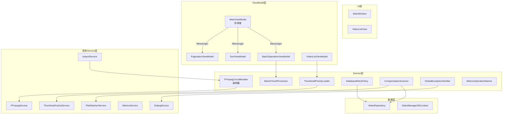

# 设计文档

## 概述

本设计文档描述 VideoManager WPF 应用程序第四轮优化的技术方案。优化涵盖七个核心领域：

1. **缩略图优先级加载** — 使用 `Channel<T>` 实现可视区域优先的缩略图加载队列
2. **批量操作分块** — 将大批量操作拆分为固定大小的块，每块之间让出 UI 线程
3. **FFmpeg 熔断器** — 使用 Polly CircuitBreaker 防止 FFmpeg 反复失败拖慢导入
4. **数据库重试策略** — 使用 Polly 指数退避处理 SQLITE_BUSY 瞬态错误
5. **FileWatcher 补偿扫描** — 定期全量扫描弥补 FileSystemWatcher 丢事件
6. **全局异常处理增强** — 统一捕获未处理异常，记录日志并展示友好提示
7. **MainViewModel 拆分 + 代码质量** — 职责拆分、消除魔法字符串、IAsyncDisposable

## 架构

### 整体架构图



### 设计决策

| 决策 | 选择 | 理由 |
|------|------|------|
| 缩略图队列实现 | `Channel<T>` + 优先级标记 | .NET 原生高性能异步队列，无需第三方依赖 |
| 熔断器实现 | Polly `CircuitBreakerStrategy` | 项目已引入 Polly.Core 8.6.5，直接复用 |
| FFmpeg 熔断器集成方式 | 装饰器模式包装 `IFFmpegService` | 不修改现有 FFmpegService，符合开闭原则 |
| 数据库重试集成方式 | 在 VideoRepository 内部包装 | 重试逻辑与数据访问紧密相关，内聚性高 |
| ViewModel 通信 | `WeakReferenceMessenger` | CommunityToolkit.Mvvm 内置，弱引用避免内存泄漏 |
| 补偿扫描集成 | 扩展 FileWatcherService | 复用现有文件监控基础设施，减少新类 |
| 批量分块大小 | 默认 50，可配置 | 平衡 UI 响应性和操作效率 |

## 组件与接口

### 1. ThumbnailPriorityLoader

```csharp
/// <summary>
/// 基于 Channel<T> 的缩略图优先级加载服务。
/// 可视区域内的请求优先处理，滚动时取消不可见项的请求。
/// </summary>
public interface IThumbnailPriorityLoader : IAsyncDisposable
{
    /// <summary>
    /// 将缩略图加载请求入队。
    /// </summary>
    /// <param name="videoId">视频 ID</param>
    /// <param name="thumbnailPath">缩略图文件路径</param>
    /// <param name="isVisible">是否在当前可视区域内</param>
    void Enqueue(int videoId, string thumbnailPath, bool isVisible);

    /// <summary>
    /// 更新可视区域，取消不可见项的待处理请求。
    /// </summary>
    /// <param name="visibleVideoIds">当前可视区域内的视频 ID 集合</param>
    void UpdateVisibleItems(IReadOnlySet<int> visibleVideoIds);

    /// <summary>
    /// 缩略图加载完成事件。
    /// </summary>
    event Action<int, string?>? ThumbnailLoaded;
}

**实现要点：**
- 内部使用 `Channel<ThumbnailRequest>` 作为请求队列
- `ThumbnailRequest` 包含 `VideoId`、`ThumbnailPath`、`IsVisible`、`CancellationTokenSource`
- 后台消费者 Task 从 Channel 读取请求，优先处理 `IsVisible=true` 的请求
- 使用 `ConcurrentDictionary<int, CancellationTokenSource>` 跟踪待处理请求
- `UpdateVisibleItems` 时取消所有不在新可视集合中的待处理请求
- 通过 `IThumbnailCacheService.LoadThumbnailAsync` 执行实际加载

### 2. BatchChunkProcessor

```csharp
/// <summary>
/// 批量操作分块处理器。将大批量操作拆分为固定大小的块，
/// 每块之间通过 Task.Yield() 让出 UI 线程。
/// </summary>
public static class BatchChunkProcessor
{
    /// <summary>
    /// 默认块大小。
    /// </summary>
    public const int DefaultChunkSize = 50;

    /// <summary>
    /// 分块执行异步操作。
    /// </summary>
    /// <typeparam name="T">操作项类型</typeparam>
    /// <param name="items">待处理项集合</param>
    /// <param name="processChunk">处理单个块的异步委托</param>
    /// <param name="progress">进度报告</param>
    /// <param name="ct">取消令牌</param>
    /// <param name="chunkSize">块大小，默认 50</param>
    public static async Task ProcessInChunksAsync<T>(
        IReadOnlyList<T> items,
        Func<IReadOnlyList<T>, CancellationToken, Task> processChunk,
        IProgress<(int completed, int total)>? progress,
        CancellationToken ct,
        int chunkSize = DefaultChunkSize);
}
```

**实现要点：**
- 使用 LINQ `Chunk(chunkSize)` 或手动分块
- 每块处理后调用 `await Task.Yield()` 让出执行权
- 检查 `ct.IsCancellationRequested` 在每块之间
- 通过 `progress` 报告已完成数量

### 3. ResilientFFmpegService（FFmpeg 熔断器装饰器）

```csharp
/// <summary>
/// FFmpegService 的熔断器装饰器。
/// 使用 Polly CircuitBreakerStrategy 包装所有 FFmpeg 调用。
/// </summary>
public class ResilientFFmpegService : IFFmpegService
{
    private readonly IFFmpegService _inner;
    private readonly ResiliencePipeline _circuitBreakerPipeline;
    private readonly ILogger<ResilientFFmpegService> _logger;

    // 熔断器配置：30秒窗口内5次失败 → Open 60秒
}
```

**Polly 配置：**
```csharp
new ResiliencePipelineBuilder()
    .AddCircuitBreaker(new CircuitBreakerStrategyOptions
    {
        FailureRatio = 1.0,           // 100% 失败率触发
        SamplingDuration = TimeSpan.FromSeconds(30),
        MinimumThroughput = 5,        // 至少5次调用
        BreakDuration = TimeSpan.FromSeconds(60),
        ShouldHandle = new PredicateBuilder()
            .Handle<Exception>(ex => ex is not OperationCanceledException),
        OnOpened = args => { /* 记录日志 */ },
        OnClosed = args => { /* 记录日志 */ },
        OnHalfOpened = args => { /* 记录日志 */ }
    })
    .Build();
```

### 4. DatabaseRetryPolicy

```csharp
/// <summary>
/// SQLite 写操作重试策略。
/// 使用 Polly 指数退避处理 SQLITE_BUSY 错误。
/// </summary>
public static class DatabaseRetryPolicy
{
    /// <summary>
    /// 创建 SQLite 写操作重试管道。
    /// 3次重试，延迟 100ms → 200ms → 400ms。
    /// </summary>
    public static ResiliencePipeline CreateRetryPipeline(ILogger? logger = null);
}
```

**Polly 配置：**
```csharp
new ResiliencePipelineBuilder()
    .AddRetry(new RetryStrategyOptions
    {
        MaxRetryAttempts = 3,
        Delay = TimeSpan.FromMilliseconds(100),
        BackoffType = DelayBackoffType.Exponential,
        UseJitter = false,
        ShouldHandle = new PredicateBuilder()
            .Handle<Microsoft.Data.Sqlite.SqliteException>(ex => ex.SqliteErrorCode == 5), // SQLITE_BUSY
        OnRetry = args => { /* 记录日志 */ }
    })
    .Build();
```

**集成方式：** 在 `VideoRepository` 的 `AddAsync`、`AddRangeAsync`、`UpdateAsync`、`DeleteAsync` 方法中包装 `SaveChangesAsync` 调用。

### 5. CompensationScanner（集成到 FileWatcherService）

```csharp
/// <summary>
/// 扩展 IFileWatcherService 接口，增加补偿扫描能力。
/// </summary>
public interface IFileWatcherService : IDisposable, IAsyncDisposable
{
    // ... 现有成员 ...

    /// <summary>
    /// 启动定期补偿扫描。
    /// </summary>
    /// <param name="scanIntervalHours">扫描间隔（小时），默认 1</param>
    void StartCompensationScan(double scanIntervalHours = 1.0);

    /// <summary>
    /// 停止补偿扫描。
    /// </summary>
    void StopCompensationScan();

    /// <summary>
    /// 文件缺失事件（补偿扫描发现）。
    /// </summary>
    event EventHandler<FilesMissingEventArgs>? FilesMissing;

    /// <summary>
    /// 文件恢复事件（补偿扫描发现之前缺失的文件重新出现）。
    /// </summary>
    event EventHandler<FilesRestoredEventArgs>? FilesRestored;
}
```

**实现要点：**
- 使用 `System.Threading.Timer` 定期触发扫描
- 扫描逻辑：获取数据库中所有视频的 FilePath → 检查文件是否存在 → 对比标记
- 需要注入 `IVideoRepository` 或通过 `IDbContextFactory` 创建独立 DbContext
- 扫描在后台线程执行，不阻塞 UI

### 6. GlobalExceptionHandler

```csharp
/// <summary>
/// 全局异常处理模块。
/// 在 App.xaml.cs 中初始化，统一处理未捕获异常。
/// </summary>
public class GlobalExceptionHandler
{
    private readonly ILogger<GlobalExceptionHandler> _logger;
    private readonly IDialogService _dialogService;

    /// <summary>
    /// 注册所有全局异常处理器。
    /// </summary>
    public void Register(Application app);

    /// <summary>
    /// 处理 UI 线程未处理异常。
    /// </summary>
    internal void HandleDispatcherException(
        object sender, DispatcherUnhandledExceptionEventArgs args);

    /// <summary>
    /// 处理未观察的任务异常。
    /// </summary>
    internal void HandleUnobservedTaskException(
        object sender, UnobservedTaskExceptionEventArgs args);
}
```

### 7. ViewModel 拆分 — Messenger 消息定义

```csharp
// 分页消息
public record PageChangedMessage(int NewPage);
public record PageInfoUpdatedMessage(int CurrentPage, int TotalPages, int TotalCount);

// 排序消息
public record SortChangedMessage(SortField Field, SortDirection Direction);

// 批量操作消息
public record BatchOperationCompletedMessage(string OperationType, int SuccessCount, int FailCount);
public record RefreshRequestedMessage;
```

### 8. MetricsOperationNames

```csharp
/// <summary>
/// MetricsService 操作名称常量集合。
/// </summary>
public static class MetricsOperationNames
{
    public const string ThumbnailGeneration = "thumbnail_generation";
    public const string Import = "import";
    public const string ImportFile = "import_file";
    public const string Search = "search";
    public const string DatabaseQuery = "database_query";
    public const string BatchDelete = "batch_delete";
    public const string BatchTag = "batch_tag";
    public const string BatchCategory = "batch_category";
    public const string CompensationScan = "compensation_scan";
}
```

## 数据模型

### ThumbnailRequest

```csharp
/// <summary>
/// 缩略图加载请求。
/// </summary>
public record ThumbnailRequest(
    int VideoId,
    string ThumbnailPath,
    bool IsVisible,
    CancellationTokenSource Cts);
```

### Messenger 消息类型

上述第 7 节已定义所有消息类型。

### VideoManagerOptions 扩展

```csharp
// 新增配置项
public class VideoManagerOptions
{
    // ... 现有属性 ...

    /// <summary>
    /// 补偿扫描间隔（小时），默认 1。
    /// </summary>
    public double CompensationScanIntervalHours { get; set; } = 1.0;

    /// <summary>
    /// 批量操作默认块大小，默认 50。
    /// </summary>
    public int BatchChunkSize { get; set; } = 50;
}
```

### FilesMissingEventArgs / FilesRestoredEventArgs

```csharp
public record FilesMissingEventArgs(IReadOnlyList<string> MissingFilePaths);
public record FilesRestoredEventArgs(IReadOnlyList<string> RestoredFilePaths);
```

## 正确性属性

*正确性属性是一种在系统所有有效执行中都应成立的特征或行为——本质上是关于系统应该做什么的形式化陈述。属性是人类可读规范与机器可验证正确性保证之间的桥梁。*

### Property 1: 缩略图优先级排序

*对于任意*一组混合可见性的缩略图加载请求，所有标记为可见（`IsVisible=true`）的请求应在所有不可见请求之前被消费处理。

**Validates: Requirements 1.1, 1.3**

### Property 2: 滚动时取消不可见请求

*对于任意*一组待处理的缩略图加载请求和任意新的可视区域集合，调用 `UpdateVisibleItems` 后，所有不在新可视集合中的待处理请求的 `CancellationTokenSource` 应被取消，而在新可视集合中的请求应保持未取消状态。

**Validates: Requirements 1.2**

### Property 3: 缩略图加载错误恢复

*对于任意*一组缩略图加载请求序列，其中部分请求会导致加载异常，加载器应继续处理所有后续非异常请求，不因单个请求的失败而停止整个消费循环。

**Validates: Requirements 1.5**

### Property 4: 批量分块正确性

*对于任意*长度为 N 的项目列表和任意正整数块大小 C，`BatchChunkProcessor.ProcessInChunksAsync` 应恰好调用处理委托 ⌈N/C⌉ 次，每次传入的块大小不超过 C，且所有项目恰好被处理一次。

**Validates: Requirements 2.1, 2.2, 2.3, 2.4, 2.6**

### Property 5: 批量分块取消

*对于任意*长度为 N 的项目列表和任意块大小 C，当取消令牌在第 K 个块处理完成后被触发时（1 ≤ K < ⌈N/C⌉），恰好有 K 个块被处理，剩余块不被执行。

**Validates: Requirements 2.5**

### Property 6: 熔断器连续失败后开启

*对于任意*连续 5 次或以上的 FFmpeg 调用失败序列（在 30 秒窗口内），后续调用应立即失败（抛出 `BrokenCircuitException`）而不实际调用内部 FFmpegService。

**Validates: Requirements 3.2, 3.3**

### Property 7: 数据库重试仅针对 SQLITE_BUSY

*对于任意* `SqliteException`，当且仅当其 `SqliteErrorCode` 为 5（SQLITE_BUSY）时，`DatabaseRetryPolicy` 应触发重试（最多 3 次）。对于其他类型的异常，应立即向上抛出而不重试。

**Validates: Requirements 4.1, 4.2**

### Property 8: 补偿扫描文件对比正确性

*对于任意*一组数据库视频记录和任意文件系统状态，补偿扫描后：(a) 数据库中存在但文件系统中不存在的记录应被标记为 `IsFileMissing=true`；(b) 之前标记为 `IsFileMissing=true` 但文件已重新出现的记录应被恢复为 `IsFileMissing=false`。

**Validates: Requirements 5.2, 5.3, 5.4**

## 错误处理

### 缩略图加载

- 单个缩略图加载失败：记录 Debug 日志，跳过该项，继续处理队列中的下一个请求
- Channel 写入失败（队列已满）：丢弃请求，记录 Warning 日志
- 后台消费者 Task 异常：捕获异常，记录 Error 日志，重新启动消费循环

### 批量操作

- 单个块处理失败：记录错误，继续处理下一个块（除非是取消操作）
- 取消操作：当前块完成后停止，已完成的操作不回滚
- 进度报告异常：捕获并忽略，不影响主流程

### FFmpeg 熔断器

- 熔断器 Open 状态：立即抛出 `BrokenCircuitException`，调用方（ImportService）应捕获并使用默认元数据
- HalfOpen 试探失败：重新进入 Open 状态
- 熔断器状态变化：通过 ILogger 记录 Warning 级别日志

### 数据库重试

- SQLITE_BUSY：按指数退避重试 3 次（100ms → 200ms → 400ms）
- 其他 SqliteException：不重试，直接抛出
- 所有重试耗尽：抛出最终异常，由上层处理
- 每次重试：记录 Warning 日志，包含尝试次数和延迟

### 补偿扫描

- 扫描过程中文件系统访问异常：记录 Error 日志，跳过该文件，继续扫描
- 数据库查询异常：记录 Error 日志，终止本次扫描，等待下一周期
- Timer 回调异常：捕获并记录，防止 Timer 停止

### 全局异常处理

- DispatcherUnhandledException：记录完整异常到 ILogger，通过 DialogService 展示友好消息，设置 `Handled=true`
- UnobservedTaskException：记录完整异常到 ILogger，调用 `SetObserved()`，通过 DialogService 展示友好消息
- DialogService 本身异常：回退到 `MessageBox.Show` 直接显示

## 测试策略

### 测试框架

- **单元测试**: xUnit
- **属性测试**: FsCheck（项目已引入）
- **Mocking**: 使用接口和手动 mock / 简单 stub

### 属性测试配置

- 每个属性测试最少运行 100 次迭代
- 每个属性测试必须通过注释引用设计文档中的属性编号
- 标签格式: `Feature: video-manager-optimization-v4, Property {number}: {property_text}`

### 双重测试方法

**属性测试**（验证通用正确性）：
- Property 1: 生成随机可见性标记的请求集合，验证处理顺序
- Property 2: 生成随机待处理请求集和随机新可视集合，验证取消行为
- Property 3: 生成随机请求序列（部分会失败），验证错误恢复
- Property 4: 生成随机列表长度和块大小，验证分块次数和大小
- Property 5: 生成随机列表和取消点，验证取消后的块处理数
- Property 6: 模拟连续失败序列，验证熔断器开启行为
- Property 7: 生成随机异常类型（SQLITE_BUSY vs 其他），验证重试行为
- Property 8: 生成随机数据库记录集和文件存在状态，验证标记正确性

**单元测试**（验证具体示例和边界情况）：
- 空列表的批量分块处理
- 块大小大于列表长度的情况
- 熔断器 HalfOpen 状态的试探性调用
- 补偿扫描空数据库的情况
- GlobalExceptionHandler 的 Handled 标志设置
- MetricsOperationNames 包含所有必需常量
- IAsyncDisposable 的 DisposeAsync 正确释放资源
- PaginationViewModel / SortViewModel / BatchOperationViewModel 的 Messenger 消息发送
