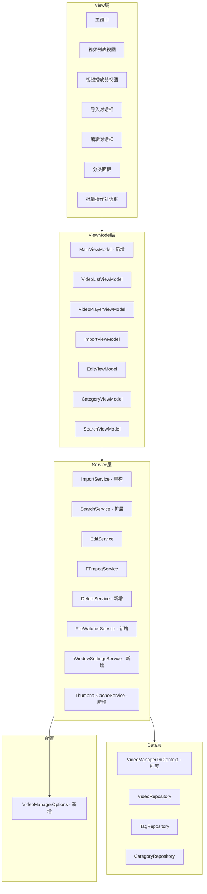
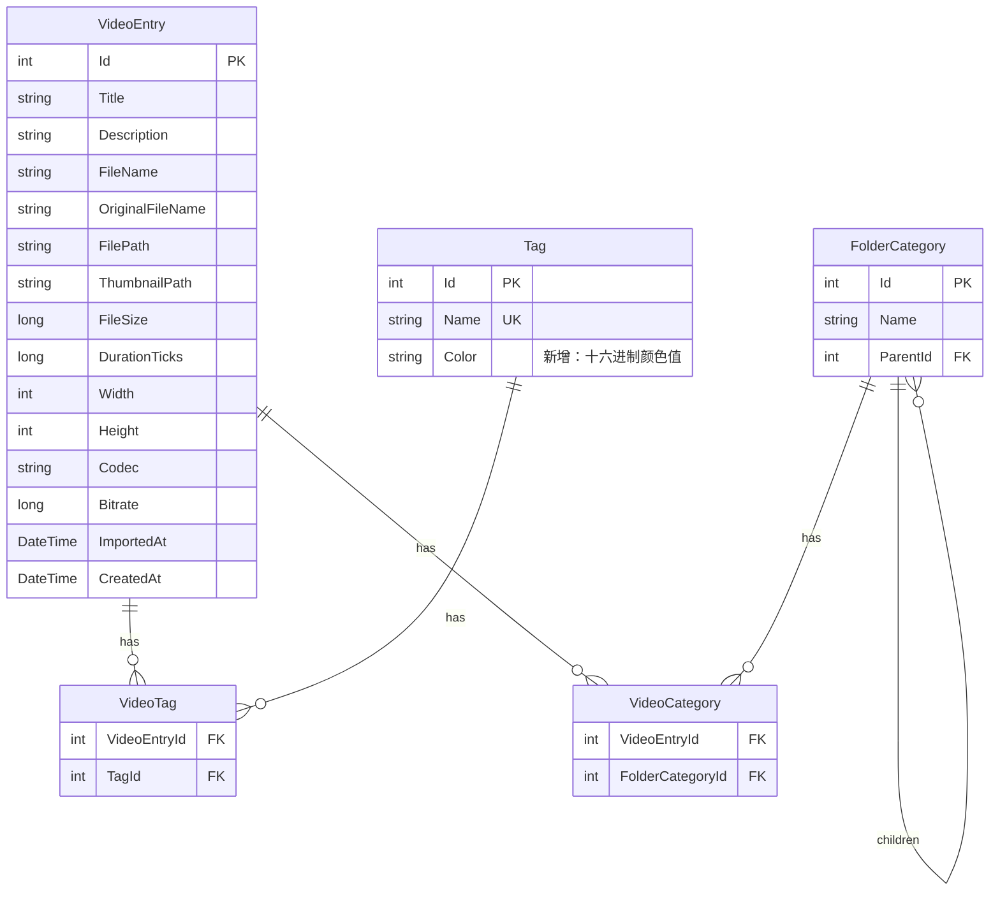

# 设计文档：视频管理器优化

## 概述

本设计文档描述对现有 WPF 视频管理桌面应用的优化方案。优化基于现有 MVVM 架构（CommunityToolkit.Mvvm）、SQLite + EF Core 数据层、FFmpeg 集成进行增量改进，不改变核心架构模式。

主要设计目标：
- 增强用户交互体验（右键菜单、实时搜索、排序、快捷键、批量操作）
- 提升大数据量下的性能（缩略图懒加载、索引优化、并行导入）
- 改善代码架构（提取 MainViewModel、IOptions 配置）
- 扩展功能（视频删除、系统播放器、标签颜色、文件监控）

## 架构

优化后的架构在现有 MVVM 分层基础上进行扩展：



### 关键架构决策

1. **提取 MainViewModel**：将 MainWindow.xaml.cs 中约 200 行协调逻辑（搜索触发、分页、刷新、状态文本）迁移到 MainViewModel，MainWindow.xaml.cs 仅保留对话框窗口创建等纯 UI 操作
2. **IOptions 配置模式**：引入 `VideoManagerOptions` 配置类，通过 `IOptions<VideoManagerOptions>` 注入路径配置，替代 ImportService 构造函数中的字符串参数
3. **新增 Service**：DeleteService（视频删除）、FileWatcherService（文件监控）、WindowSettingsService（窗口设置持久化）、ThumbnailCacheService（缩略图内存缓存）
4. **SearchService 扩展**：增加排序参数支持（SortField + SortDirection）
5. **防抖搜索**：在 MainViewModel 中使用 `CancellationTokenSource` 实现 300ms 防抖逻辑，无需额外库

## 组件与接口

### 新增配置类

```csharp
public class VideoManagerOptions
{
    public string VideoLibraryPath { get; set; } = string.Empty;
    public string ThumbnailDirectory { get; set; } = string.Empty;
}
```

### 新增/修改 Service 接口

```csharp
// 视频删除服务
public interface IDeleteService
{
    /// <summary>
    /// 从数据库删除视频记录及关联关系。
    /// deleteFile=true 时同时删除视频文件和缩略图文件。
    /// </summary>
    Task<DeleteResult> DeleteVideoAsync(int videoId, bool deleteFile, CancellationToken ct);

    /// <summary>
    /// 批量删除多个视频。
    /// </summary>
    Task<BatchDeleteResult> BatchDeleteAsync(List<int> videoIds, bool deleteFiles, IProgress<BatchProgress>? progress, CancellationToken ct);
}

public record DeleteResult(bool Success, string? ErrorMessage);
public record BatchDeleteResult(int SuccessCount, int FailCount, List<DeleteError> Errors);
public record DeleteError(int VideoId, string Reason);
public record BatchProgress(int Completed, int Total);
```

```csharp
// 文件系统监控服务
public interface IFileWatcherService : IDisposable
{
    /// <summary>
    /// 开始监控指定目录。
    /// </summary>
    void StartWatching(string directoryPath);

    /// <summary>
    /// 停止监控。
    /// </summary>
    void StopWatching();

    /// <summary>
    /// 文件被删除时触发。
    /// </summary>
    event EventHandler<FileDeletedEventArgs> FileDeleted;

    /// <summary>
    /// 文件被重命名时触发。
    /// </summary>
    event EventHandler<FileRenamedEventArgs> FileRenamed;
}

public record FileDeletedEventArgs(string FilePath);
public record FileRenamedEventArgs(string OldPath, string NewPath);
```

```csharp
// 窗口设置服务
public interface IWindowSettingsService
{
    WindowSettings? Load();
    void Save(WindowSettings settings);
}

public record WindowSettings(
    double Left,
    double Top,
    double Width,
    double Height,
    bool IsMaximized
);
```

```csharp
// 缩略图缓存服务
public interface IThumbnailCacheService
{
    /// <summary>
    /// 异步加载缩略图，优先从内存缓存返回。
    /// </summary>
    Task<string?> LoadThumbnailAsync(string thumbnailPath);

    /// <summary>
    /// 清除缓存。
    /// </summary>
    void ClearCache();
}
```

### 搜索服务扩展

```csharp
// 扩展 SearchCriteria 以支持排序
public record SearchCriteria(
    string? Keyword,
    List<int>? TagIds,
    DateTime? DateFrom,
    DateTime? DateTo,
    TimeSpan? DurationMin,
    TimeSpan? DurationMax,
    SortField SortBy = SortField.ImportedAt,
    SortDirection SortDir = SortDirection.Descending
);

public enum SortField
{
    ImportedAt,
    Duration,
    FileSize
}

public enum SortDirection
{
    Ascending,
    Descending
}
```

### ImportService 重构

```csharp
// 重构后的 ImportService 使用 IOptions 和并行处理
public class ImportService : IImportService
{
    private readonly IFFmpegService _ffmpegService;
    private readonly IVideoRepository _videoRepository;
    private readonly VideoManagerOptions _options;

    public ImportService(
        IFFmpegService ffmpegService,
        IVideoRepository videoRepository,
        IOptions<VideoManagerOptions> options)
    {
        _ffmpegService = ffmpegService;
        _videoRepository = videoRepository;
        _options = options.Value;
    }

    /// <summary>
    /// 并行导入：文件复制串行（避免 IO 竞争），
    /// 元数据提取和缩略图生成使用 SemaphoreSlim 控制并行度。
    /// </summary>
    public async Task<ImportResult> ImportVideosAsync(
        List<VideoFileInfo> files, ImportMode mode,
        IProgress<ImportProgress> progress, CancellationToken ct)
    {
        // 使用 Environment.ProcessorCount 作为最大并行度
        // 文件复制仍然串行，元数据提取并行
    }
}
```

### MainViewModel

```csharp
public partial class MainViewModel : ViewModelBase
{
    private readonly VideoListViewModel _videoListVm;
    private readonly SearchViewModel _searchVm;
    private readonly CategoryViewModel _categoryVm;

    [ObservableProperty]
    private string _statusText = "就绪";

    [ObservableProperty]
    private string _searchKeyword = string.Empty;

    [ObservableProperty]
    private string _pageInfoText = "第 1 页";

    // 防抖搜索
    private CancellationTokenSource? _debounceCts;

    // 排序状态
    [ObservableProperty]
    private SortField _currentSortField = SortField.ImportedAt;

    [ObservableProperty]
    private SortDirection _currentSortDirection = SortDirection.Descending;

    // 搜索关键词变化时触发防抖
    partial void OnSearchKeywordChanged(string value)
    {
        _ = DebouncedSearchAsync(value);
    }

    private async Task DebouncedSearchAsync(string keyword)
    {
        _debounceCts?.Cancel();
        _debounceCts = new CancellationTokenSource();
        var token = _debounceCts.Token;

        try
        {
            await Task.Delay(300, token);
            if (!token.IsCancellationRequested)
            {
                await ExecuteSearchAsync(keyword, token);
            }
        }
        catch (OperationCanceledException) { }
    }
}
```

### VideoPlayerViewModel 扩展

```csharp
// 新增播放速度和跳转方法
public partial class VideoPlayerViewModel : ViewModelBase
{
    private static readonly double[] SpeedOptions = { 0.5, 1.0, 1.5, 2.0 };

    [ObservableProperty]
    private double _playbackSpeed = 1.0;

    private int _currentSpeedIndex = 1; // 默认 1.0x

    /// <summary>
    /// 循环切换播放速度。
    /// </summary>
    [RelayCommand]
    private void CycleSpeed()
    {
        _currentSpeedIndex = (_currentSpeedIndex + 1) % SpeedOptions.Length;
        PlaybackSpeed = SpeedOptions[_currentSpeedIndex];
    }

    /// <summary>
    /// 跳转指定秒数（正数前进，负数后退），限制在 [0, Duration] 范围内。
    /// </summary>
    public void Skip(double seconds)
    {
        var newPosition = Position + TimeSpan.FromSeconds(seconds);
        if (newPosition < TimeSpan.Zero) newPosition = TimeSpan.Zero;
        if (newPosition > Duration) newPosition = Duration;
        Position = newPosition;
    }
}
```

### 批量操作接口

```csharp
// EditService 扩展批量操作
public interface IEditService
{
    // 现有方法...
    Task<VideoEntry> UpdateVideoInfoAsync(int videoId, string title, string? description, CancellationToken ct);
    Task AddTagToVideoAsync(int videoId, int tagId, CancellationToken ct);
    Task RemoveTagFromVideoAsync(int videoId, int tagId, CancellationToken ct);

    // 新增批量操作
    Task BatchAddTagAsync(List<int> videoIds, int tagId, CancellationToken ct);
    Task BatchMoveToCategoryAsync(List<int> videoIds, int categoryId, CancellationToken ct);
}
```

## 数据模型

### Tag 模型扩展

```csharp
public class Tag
{
    public int Id { get; set; }
    public string Name { get; set; } = string.Empty;
    public string? Color { get; set; }  // 新增：十六进制颜色值，如 "#FF5722"
    public ICollection<VideoEntry> Videos { get; set; } = new List<VideoEntry>();
}
```

### VideoEntry 扩展

```csharp
public class VideoEntry
{
    // 现有属性保持不变...

    /// <summary>
    /// 标记文件是否缺失（由 FileWatcher 检测）。不持久化到数据库。
    /// </summary>
    [NotMapped]
    public bool IsFileMissing { get; set; }
}
```

### WindowSettings 持久化

窗口设置使用 JSON 文件存储在应用数据目录中：

```
{AppBaseDirectory}/Data/window-settings.json
```

```json
{
  "left": 100,
  "top": 100,
  "width": 1280,
  "height": 720,
  "isMaximized": false
}
```

### 数据库迁移

新增 EF Core 迁移以添加 Tag.Color 列和 FileSize 索引：

```csharp
// DbContext OnModelCreating 扩展
protected override void OnModelCreating(ModelBuilder modelBuilder)
{
    // 现有配置...

    // 新增 FileSize 索引
    modelBuilder.Entity<VideoEntry>()
        .HasIndex(v => v.FileSize);

    // Tag.Color 列（可选，无需索引）
    modelBuilder.Entity<Tag>()
        .Property(t => t.Color)
        .HasMaxLength(9); // "#RRGGBBAA"
}
```

### ER 图更新




## 正确性属性

*属性（Property）是指在系统所有有效执行中都应成立的特征或行为——本质上是关于系统应该做什么的形式化陈述。属性是人类可读规格说明与机器可验证正确性保证之间的桥梁。*

### Property 1: 防抖搜索行为

*For any* 输入序列和时间间隔，仅当最后一次输入后经过 300 毫秒无新输入时，搜索才会执行。在 300 毫秒内的连续输入应重置计时器，且新输入到达时应取消正在执行的搜索请求。

**Validates: Requirements 2.1, 2.2, 2.3**

### Property 2: 排序正确性

*For any* 视频列表、排序字段（时长/文件大小/导入日期）和排序方向（升序/降序），排序后的结果列表中每对相邻元素应满足指定字段的排序关系。

**Validates: Requirements 3.2, 3.3**

### Property 3: 播放位置跳转与边界限制

*For any* 视频播放位置和跳转秒数（正数或负数），跳转后的位置应等于 `clamp(原位置 + 跳转秒数, 0, 视频总时长)`，即结果始终在 [0, Duration] 范围内。

**Validates: Requirements 4.1, 4.2, 4.5**

### Property 4: 播放/暂停状态切换

*For any* 播放状态（播放中或暂停中），执行切换操作后，状态应变为相反状态：播放中变为暂停，暂停变为播放。

**Validates: Requirements 4.3**

### Property 5: 播放速度循环切换

*For any* 当前速度索引 i（0-3 对应 0.5x/1.0x/1.5x/2.0x），执行一次循环切换后，速度索引应变为 (i + 1) % 4，对应的速度值应为 SpeedOptions[(i + 1) % 4]。

**Validates: Requirements 4.4**

### Property 6: 窗口设置 round-trip

*For any* 有效的 WindowSettings（Left、Top、Width、Height、IsMaximized），保存后再加载应得到与原始值相等的 WindowSettings 对象。

**Validates: Requirements 5.1, 5.2**

### Property 7: 批量标签分配

*For any* 视频 ID 集合和 Tag ID，执行批量标签分配后，查询每个视频的 Tags 集合应包含该 Tag。

**Validates: Requirements 6.3**

### Property 8: 批量分类移动

*For any* 视频 ID 集合和 Folder_Category ID，执行批量分类移动后，查询每个视频的 Categories 集合应包含该 Folder_Category。

**Validates: Requirements 6.4**

### Property 9: 缩略图缓存幂等性

*For any* 有效的缩略图路径，连续两次调用 LoadThumbnailAsync 应返回相同的结果，且第二次调用应从内存缓存返回而非重新读取磁盘。

**Validates: Requirements 7.2**

### Property 10: 并行导入一致性

*For any* 视频文件批次，并行导入的最终结果（成功数 + 失败数 = 总数，且每个成功导入的视频在数据库中有对应记录）应与串行导入一致。

**Validates: Requirements 9.1, 9.2**

### Property 11: 仅从库中删除

*For any* 数据库中存在的 Video_Entry，执行"仅从库中移除"删除后，数据库中应不存在该 Video_Entry 记录，且原视频文件应仍然存在于磁盘上。

**Validates: Requirements 12.1**

### Property 12: 删除并移除源文件

*For any* 数据库中存在的 Video_Entry，执行"同时删除源文件"删除后，数据库中应不存在该 Video_Entry 记录，且对应的视频文件和缩略图文件应不存在于磁盘上。

**Validates: Requirements 12.2**

### Property 13: 文件删除检测

*For any* Video_Library 中被监控的视频文件，当该文件被删除时，对应的 Video_Entry 应被标记为 IsFileMissing = true。

**Validates: Requirements 15.2**

### Property 14: 文件重命名检测

*For any* Video_Library 中被监控的视频文件，当该文件被重命名为新路径时，对应的 Video_Entry 的 FilePath 应更新为新路径。

**Validates: Requirements 15.3**

## 错误处理

### 删除操作错误

| 场景 | 处理方式 |
|------|----------|
| 视频文件不存在（已被外部删除） | 仅删除数据库记录，提示用户文件已不存在 |
| 视频文件删除权限不足 | 完成数据库记录删除，提示文件删除失败 |
| 批量删除中某个视频失败 | 记录失败，继续处理剩余视频，最终显示结果摘要 |

### 文件监控错误

| 场景 | 处理方式 |
|------|----------|
| FileSystemWatcher 初始化失败 | 记录错误日志，应用继续正常运行，文件监控降级 |
| 监控缓冲区溢出 | 记录警告，触发全量文件状态检查 |
| 文件事件处理异常 | 捕获异常，记录日志，不影响其他事件处理 |

### 窗口设置错误

| 场景 | 处理方式 |
|------|----------|
| 配置文件不存在 | 使用默认值（1280×720，居中） |
| 配置文件 JSON 格式错误 | 使用默认值，记录警告日志 |
| 窗口位置超出屏幕范围 | 重置到屏幕中央 |

### 搜索与排序错误

| 场景 | 处理方式 |
|------|----------|
| 防抖搜索执行失败 | 显示搜索失败提示，保留当前列表 |
| 排序查询超时 | 显示超时提示，保留当前排序 |

### 缩略图加载错误

| 场景 | 处理方式 |
|------|----------|
| 缩略图文件不存在 | 返回 null，UI 显示默认占位图标 |
| 图片解码失败 | 返回 null，记录警告日志 |

## 测试策略

### 测试框架选择

- **单元测试框架**：xUnit
- **属性测试框架**：FsCheck（配合 FsCheck.Xunit 集成）
- **Mocking 框架**：Moq
- **数据库测试**：SQLite In-Memory provider

### 双重测试方法

本项目采用单元测试和属性测试互补的策略：

**单元测试**：验证具体示例、边界情况和错误条件
- 右键菜单项存在性验证
- 窗口设置超出屏幕边界的重置行为
- 删除时文件不存在的降级处理
- FileWatcher 初始化失败的降级行为
- 空搜索关键词恢复完整列表

**属性测试**：验证跨所有输入的通用属性
- 每个属性测试最少运行 100 次迭代
- 每个属性测试必须用注释引用设计文档中的属性编号
- 注释格式：**Feature: video-manager-optimization, Property {number}: {property_text}**
- 每个正确性属性由一个独立的属性测试实现

### 测试分层

```
├── VideoManager.Tests/
│   ├── Unit/
│   │   ├── ViewModels/
│   │   │   ├── MainViewModelTests.cs
│   │   │   └── VideoPlayerViewModelTests.cs
│   │   ├── Services/
│   │   │   ├── DeleteServiceTests.cs
│   │   │   ├── WindowSettingsServiceTests.cs
│   │   │   ├── ThumbnailCacheServiceTests.cs
│   │   │   └── FileWatcherServiceTests.cs
│   │   └── Repositories/
│   │       └── SearchSortTests.cs
│   └── Property/
│       ├── DebouncePropertyTests.cs         (Property 1)
│       ├── SortPropertyTests.cs             (Property 2)
│       ├── SkipPropertyTests.cs             (Property 3)
│       ├── PlayPausePropertyTests.cs        (Property 4)
│       ├── SpeedCyclePropertyTests.cs       (Property 5)
│       ├── WindowSettingsPropertyTests.cs   (Property 6)
│       ├── BatchTagPropertyTests.cs         (Property 7)
│       ├── BatchCategoryPropertyTests.cs    (Property 8)
│       ├── ThumbnailCachePropertyTests.cs   (Property 9)
│       ├── ParallelImportPropertyTests.cs   (Property 10)
│       ├── DeletePropertyTests.cs           (Property 11, 12)
│       └── FileWatcherPropertyTests.cs      (Property 13, 14)
```

### 属性测试配置示例

```csharp
// Feature: video-manager-optimization, Property 3: 播放位置跳转与边界限制
[Property(MaxTest = 100)]
public Property SkipShouldClampToValidRange()
{
    return Prop.ForAll(
        Arb.From<PositiveInt>(),  // duration in seconds
        Arb.From<int>(),          // current position in seconds
        Arb.From<int>(),          // skip amount in seconds
        (duration, position, skipAmount) =>
        {
            var vm = new VideoPlayerViewModel();
            var dur = TimeSpan.FromSeconds(Math.Abs(duration.Get));
            vm.Duration = dur;
            vm.Position = TimeSpan.FromSeconds(Math.Clamp(position, 0, (int)dur.TotalSeconds));

            vm.Skip(skipAmount);

            return vm.Position >= TimeSpan.Zero && vm.Position <= dur;
        });
}
```
