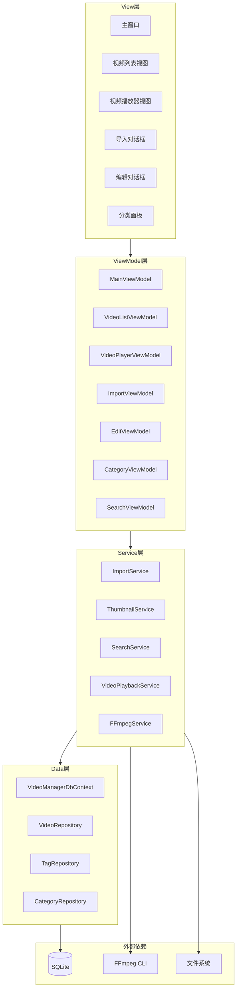
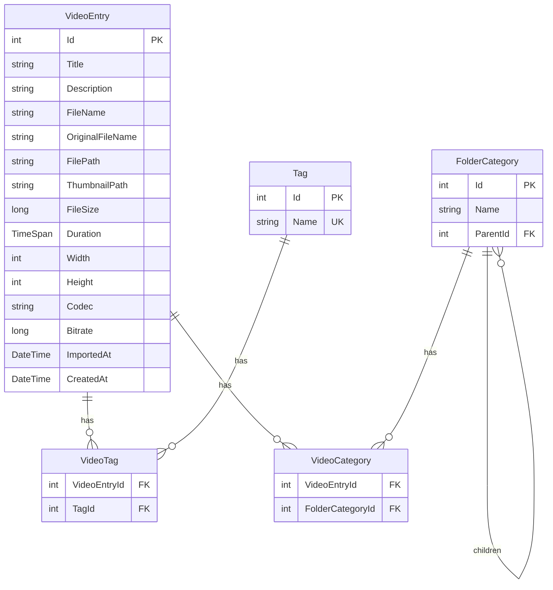

# 设计文档：视频管理桌面应用

## 概述

本设计文档描述一个基于 C# + WPF 的视频管理桌面应用的技术架构和实现方案。应用采用 MVVM 架构模式，使用 Material Design In XAML Toolkit 构建现代化 UI，SQLite + Entity Framework Core 进行数据持久化，FFmpeg 进行视频处理（元信息提取和缩略图生成）。

核心设计目标：
- 支持管理上万个视频文件，保持界面流畅
- 统一存储策略，将视频集中管理
- 清晰的分层架构，便于维护和扩展

## 架构

应用采用经典的 MVVM（Model-View-ViewModel）分层架构：



### 关键架构决策

1. **MVVM 模式**：WPF 原生支持数据绑定，MVVM 实现 View 与业务逻辑的解耦
2. **Repository 模式**：封装 EF Core 数据访问，便于测试和替换
3. **Service 层**：封装业务逻辑（导入、缩略图、搜索），ViewModel 不直接操作数据库或文件系统
4. **FFmpeg CLI 调用**：通过 `Process` 启动 FFmpeg 命令行，而非使用 FFmpeg 绑定库，降低依赖复杂度
5. **异步优先**：所有 I/O 操作（数据库查询、文件复制、FFmpeg 调用）均使用 async/await，保持 UI 响应

## 组件与接口

### Service 层接口

```csharp
// 视频导入服务
public interface IImportService
{
    Task<List<VideoFileInfo>> ScanFolderAsync(string folderPath, CancellationToken ct);
    Task<ImportResult> ImportVideosAsync(List<VideoFileInfo> files, ImportMode mode, IProgress<ImportProgress> progress, CancellationToken ct);
}

public enum ImportMode { Copy, Move }

public record VideoFileInfo(string FilePath, string FileName, long FileSize);

public record ImportProgress(int Completed, int Total, string CurrentFile);

public record ImportResult(int SuccessCount, int FailCount, List<ImportError> Errors);

public record ImportError(string FilePath, string Reason);
```

```csharp
// FFmpeg 服务
public interface IFFmpegService
{
    Task<VideoMetadata> ExtractMetadataAsync(string videoPath, CancellationToken ct);
    Task<string> GenerateThumbnailAsync(string videoPath, string outputDir, CancellationToken ct);
}

public record VideoMetadata(
    TimeSpan Duration,
    int Width,
    int Height,
    string Codec,
    long Bitrate
);
```

```csharp
// 搜索服务
public interface ISearchService
{
    Task<PagedResult<VideoEntry>> SearchAsync(SearchCriteria criteria, int page, int pageSize, CancellationToken ct);
}

public record SearchCriteria(
    string? Keyword,
    List<int>? TagIds,
    DateTime? DateFrom,
    DateTime? DateTo,
    TimeSpan? DurationMin,
    TimeSpan? DurationMax
);

public record PagedResult<T>(List<T> Items, int TotalCount, int Page, int PageSize);
```

### Repository 层接口

```csharp
public interface IVideoRepository
{
    Task<VideoEntry> AddAsync(VideoEntry entry, CancellationToken ct);
    Task<VideoEntry?> GetByIdAsync(int id, CancellationToken ct);
    Task UpdateAsync(VideoEntry entry, CancellationToken ct);
    Task DeleteAsync(int id, CancellationToken ct);
    Task<PagedResult<VideoEntry>> GetPagedAsync(int page, int pageSize, CancellationToken ct);
}

public interface ITagRepository
{
    Task<Tag> AddAsync(Tag tag, CancellationToken ct);
    Task<List<Tag>> GetAllAsync(CancellationToken ct);
    Task DeleteAsync(int id, CancellationToken ct);
    Task<bool> ExistsByNameAsync(string name, CancellationToken ct);
}

public interface ICategoryRepository
{
    Task<FolderCategory> AddAsync(FolderCategory category, CancellationToken ct);
    Task<List<FolderCategory>> GetTreeAsync(CancellationToken ct);
    Task DeleteAsync(int id, CancellationToken ct);
}
```

## 数据模型

### Entity Framework Core 实体



### C# 实体类

```csharp
public class VideoEntry
{
    public int Id { get; set; }
    public string Title { get; set; } = string.Empty;
    public string? Description { get; set; }
    public string FileName { get; set; } = string.Empty;
    public string? OriginalFileName { get; set; }
    public string FilePath { get; set; } = string.Empty;
    public string? ThumbnailPath { get; set; }
    public long FileSize { get; set; }
    public TimeSpan Duration { get; set; }
    public int Width { get; set; }
    public int Height { get; set; }
    public string? Codec { get; set; }
    public long Bitrate { get; set; }
    public DateTime ImportedAt { get; set; }
    public DateTime CreatedAt { get; set; }

    public ICollection<Tag> Tags { get; set; } = new List<Tag>();
    public ICollection<FolderCategory> Categories { get; set; } = new List<FolderCategory>();
}

public class Tag
{
    public int Id { get; set; }
    public string Name { get; set; } = string.Empty;
    public ICollection<VideoEntry> Videos { get; set; } = new List<VideoEntry>();
}

public class FolderCategory
{
    public int Id { get; set; }
    public string Name { get; set; } = string.Empty;
    public int? ParentId { get; set; }
    public FolderCategory? Parent { get; set; }
    public ICollection<FolderCategory> Children { get; set; } = new List<FolderCategory>();
    public ICollection<VideoEntry> Videos { get; set; } = new List<VideoEntry>();
}
```

### DbContext 配置

```csharp
public class VideoManagerDbContext : DbContext
{
    public DbSet<VideoEntry> VideoEntries => Set<VideoEntry>();
    public DbSet<Tag> Tags => Set<Tag>();
    public DbSet<FolderCategory> FolderCategories => Set<FolderCategory>();

    protected override void OnConfiguring(DbContextOptionsBuilder options)
    {
        var dbPath = Path.Combine(
            Environment.GetFolderPath(Environment.SpecialFolder.LocalApplicationData),
            "VideoManager", "videomanager.db");
        options.UseSqlite($"Data Source={dbPath}");
    }

    protected override void OnModelCreating(ModelBuilder modelBuilder)
    {
        modelBuilder.Entity<Tag>()
            .HasIndex(t => t.Name)
            .IsUnique();

        modelBuilder.Entity<VideoEntry>()
            .HasMany(v => v.Tags)
            .WithMany(t => t.Videos)
            .UsingEntity("VideoTag");

        modelBuilder.Entity<VideoEntry>()
            .HasMany(v => v.Categories)
            .WithMany(c => c.Videos)
            .UsingEntity("VideoCategory");

        modelBuilder.Entity<FolderCategory>()
            .HasOne(c => c.Parent)
            .WithMany(c => c.Children)
            .HasForeignKey(c => c.ParentId)
            .OnDelete(DeleteBehavior.Cascade);

        // 搜索性能索引
        modelBuilder.Entity<VideoEntry>()
            .HasIndex(v => v.Title);
        modelBuilder.Entity<VideoEntry>()
            .HasIndex(v => v.ImportedAt);
        modelBuilder.Entity<VideoEntry>()
            .HasIndex(v => v.Duration);
    }
}
```


## 正确性属性

*属性（Property）是指在系统所有有效执行中都应成立的特征或行为——本质上是关于系统应该做什么的形式化陈述。属性是人类可读规格说明与机器可验证正确性保证之间的桥梁。*

### Property 1: 文件扫描格式过滤

*For any* 文件夹结构（包含各种扩展名的文件），扫描结果应仅包含支持的视频格式（MP4、AVI、MKV、MOV、WMV，不区分大小写），不包含其他类型的文件。

**Validates: Requirements 1.1**

### Property 2: 导入 round-trip

*For any* 有效的视频文件，导入到 Video_Library 后，该文件应存在于 Video_Library 目录中，且数据库中存在对应的 Video_Entry 记录，记录中的元信息字段（Duration、Width、Height）均为有效值（非零/非默认）。

**Validates: Requirements 1.3, 1.8**

### Property 3: 导入失败隔离

*For any* 包含有效和无效文件路径的导入批次，导入完成后，所有有效文件应成功导入，所有无效文件应被记录在失败列表中，且失败文件不影响有效文件的导入结果。

**Validates: Requirements 1.6**

### Property 4: 重名文件自动重命名

*For any* 两个同名的视频文件，依次导入后，Video_Library 中应存在两个不同文件名的文件，且后导入的 Video_Entry 的 OriginalFileName 字段记录了原始文件名。

**Validates: Requirements 1.7**

### Property 5: 缩略图生成与路径记录

*For any* 成功导入的视频，其 Video_Entry 的 ThumbnailPath 字段应指向一个实际存在的图片文件。

**Validates: Requirements 2.1, 2.4**

### Property 6: Tag 唯一性约束

*For any* Tag 名称，创建该 Tag 后再次尝试创建同名 Tag 应失败（抛出异常或返回错误），数据库中该名称的 Tag 记录仅有一条。

**Validates: Requirements 3.1**

### Property 7: Tag 关联 round-trip

*For any* Video_Entry 和 Tag，将 Tag 添加到 Video_Entry 后，查询该 Video_Entry 的 Tags 集合应包含该 Tag；将 Tag 从 Video_Entry 移除后，查询结果应不包含该 Tag。

**Validates: Requirements 3.2, 3.3, 6.3**

### Property 8: 分类树 round-trip

*For any* 多级嵌套的 Folder_Category 树形结构，创建后查询应能还原完整的父子关系结构，每个节点的 ParentId 和 Children 关系正确。

**Validates: Requirements 3.4**

### Property 9: 多分类关联

*For any* Video_Entry 和多个 Folder_Category，将 Video_Entry 添加到所有这些分类后，查询该 Video_Entry 的 Categories 集合应包含所有已添加的分类。

**Validates: Requirements 3.5**

### Property 10: 删除分类或标签不影响视频

*For any* 与 Video_Entry 关联的 Folder_Category 或 Tag，删除该分类或标签后，Video_Entry 记录及其对应的视频文件应仍然存在且完整。

**Validates: Requirements 3.6, 3.7**

### Property 11: 搜索结果正确性

*For any* 搜索条件组合（关键词、Tag、日期范围、时长范围），搜索结果中的每个 Video_Entry 应同时满足所有指定的筛选条件：标题或描述包含关键词、包含指定 Tag、导入日期在范围内、时长在范围内。

**Validates: Requirements 4.1, 4.2, 4.3, 4.4, 4.5**

### Property 12: 元信息编辑持久化 round-trip

*For any* Video_Entry 和新的标题/描述值，保存后重新从数据库查询该 Video_Entry，得到的标题和描述应与保存时的值一致。

**Validates: Requirements 6.2**

### Property 13: 标题非空验证

*For any* 空字符串或纯空白字符串作为标题，保存操作应被拒绝，Video_Entry 的标题应保持原值不变。

**Validates: Requirements 6.4**

### Property 14: 分页查询正确性

*For any* 页码和页大小，返回的记录数应不超过页大小，且 TotalCount 应等于数据库中的总记录数。

**Validates: Requirements 7.2**

### Property 15: 数据库异常事务回滚

*For any* 导致异常的数据库操作，操作完成后数据库状态应与操作前一致（事务已回滚），不存在部分写入的数据。

**Validates: Requirements 8.4**

## 错误处理

### 文件操作错误

| 场景 | 处理方式 |
|------|----------|
| 源文件不存在或无读取权限 | 记录到 ImportError 列表，跳过继续处理 |
| Video_Library 目录磁盘空间不足 | 中止导入，通知用户释放空间 |
| 文件复制/移动过程中断 | 清理不完整的目标文件，记录失败 |
| 文件名包含非法字符 | 自动替换非法字符后重命名 |

### FFmpeg 错误

| 场景 | 处理方式 |
|------|----------|
| FFmpeg 未安装或路径不正确 | 启动时检测并提示用户配置 FFmpeg 路径 |
| 元信息提取失败 | 使用默认值填充，记录警告日志 |
| 缩略图生成失败 | 使用默认占位图，记录错误日志 |
| FFmpeg 进程超时 | 终止进程，使用默认值，记录超时日志 |

### 数据库错误

| 场景 | 处理方式 |
|------|----------|
| 数据库文件损坏 | 提示用户，尝试从备份恢复 |
| 唯一约束冲突（Tag 重名） | 返回友好错误信息，提示名称已存在 |
| 事务失败 | 自动回滚，向用户显示操作失败信息 |
| 并发访问冲突 | 使用乐观并发控制，提示用户重试 |

### 视频播放错误

| 场景 | 处理方式 |
|------|----------|
| 视频文件已被外部删除 | 提示文件不存在，提供从库中移除的选项 |
| 视频格式不支持 | 显示明确的格式不支持提示 |
| 视频文件损坏 | 显示播放失败提示，建议重新导入 |

## 测试策略

### 测试框架选择

- **单元测试框架**：xUnit
- **属性测试框架**：FsCheck（配合 FsCheck.Xunit 集成）
- **Mocking 框架**：Moq
- **数据库测试**：SQLite In-Memory provider

### 双重测试方法

本项目采用单元测试和属性测试互补的策略：

**单元测试**：验证具体示例、边界情况和错误条件
- 特定输入的预期输出
- 边界值测试（空列表、单元素、极大值）
- 错误路径测试（无效输入、异常场景）

**属性测试**：验证跨所有输入的通用属性
- 每个属性测试最少运行 100 次迭代
- 每个属性测试必须用注释引用设计文档中的属性编号
- 注释格式：**Feature: video-manager, Property {number}: {property_text}**
- 每个正确性属性由一个独立的属性测试实现

### 测试分层

```
├── Tests/
│   ├── Unit/
│   │   ├── Services/
│   │   │   ├── ImportServiceTests.cs
│   │   │   ├── FFmpegServiceTests.cs
│   │   │   └── SearchServiceTests.cs
│   │   ├── Repositories/
│   │   │   ├── VideoRepositoryTests.cs
│   │   │   ├── TagRepositoryTests.cs
│   │   │   └── CategoryRepositoryTests.cs
│   │   └── ViewModels/
│   │       ├── VideoListViewModelTests.cs
│   │       └── ImportViewModelTests.cs
│   └── Property/
│       ├── ScanPropertyTests.cs        (Property 1)
│       ├── ImportPropertyTests.cs       (Property 2, 3, 4)
│       ├── ThumbnailPropertyTests.cs    (Property 5)
│       ├── TagPropertyTests.cs          (Property 6, 7)
│       ├── CategoryPropertyTests.cs     (Property 8, 9, 10)
│       ├── SearchPropertyTests.cs       (Property 11)
│       ├── EditPropertyTests.cs         (Property 12, 13)
│       ├── PaginationPropertyTests.cs   (Property 14)
│       └── TransactionPropertyTests.cs  (Property 15)
```

### 属性测试配置

```csharp
// FsCheck 配置示例
// Feature: video-manager, Property 1: 文件扫描格式过滤
[Property(MaxTest = 100)]
public Property ScanShouldOnlyReturnSupportedFormats()
{
    return Prop.ForAll(
        Arb.From<NonEmptyArray<FileEntry>>(),
        files =>
        {
            var result = scanner.FilterSupportedFiles(files);
            return result.All(f => SupportedExtensions.Contains(f.Extension.ToLower()));
        });
}
```
